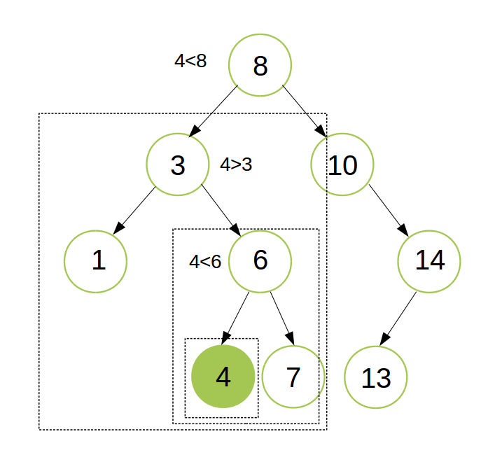
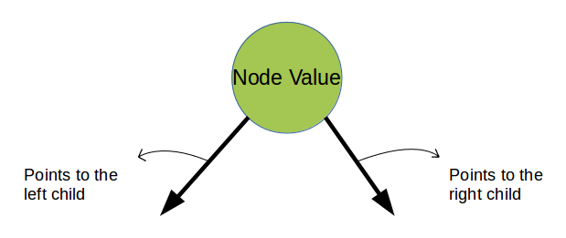

### Binary Search Tree Property

Stored keys must satisfy the binary search tree property.

  - y in left subtree of x, then key[y] < key[x].
  - y in right subtree of x, then key[y] > key[x].
  - The left and right subtree each must also be a binary search tree.

### Structure of a node in a BST

### Structure of a node in a BST

### Implementation of a Binary Search Tree using a composite data structure
Represented by a linked data structure of nodes.
root(T) points to the root of tree T.

   - Each node contains fields:
   - key
   - left – pointer to left child: root of left subtree.
   - right – pointer to right child : root of right subtree.
   - p – pointer to parent. p[root[T]] = NIL (optional).

