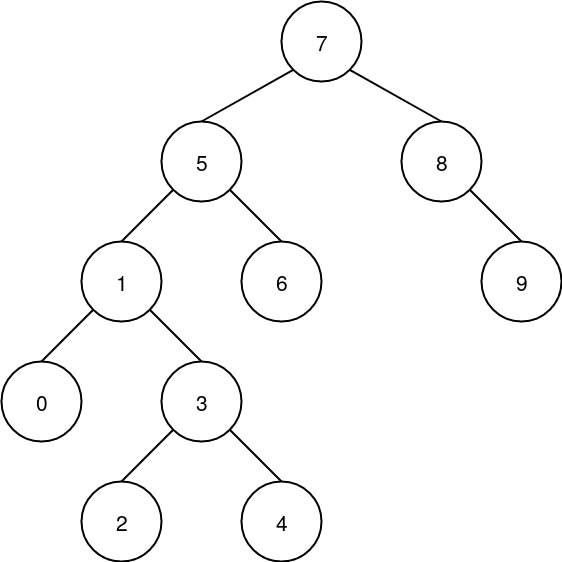
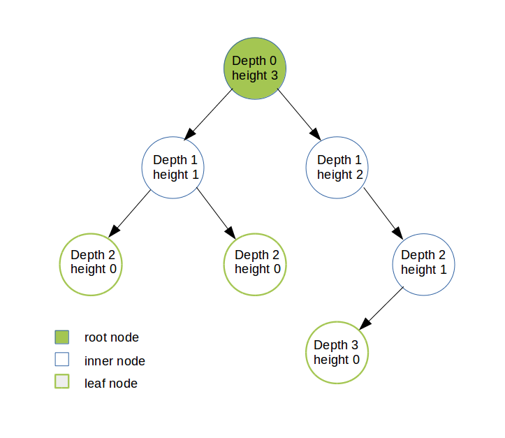

### A binary search tree as a special case of a binary tree.

### Formal Definition of BST
A binary search tree is a rooted binary tree, whose internal nodes each store a key (and optionally, an associated value) and each have two distinguished sub-trees, commonly denoted left and right. The tree additionally satisfies the binary search property, which states that the key in each node must be greater than or equal to any key stored in the left sub-tree, and less than or equal to any key stored in the right sub-tree. The leaves (final nodes) of the tree contain no key and have no structure to distinguish them from one another.

### Depiction of Terminologies

### Terminologies
   - **Depth**: The depth of a node is the number of edges in the unique path from the root to the node. Root depth=0
    *Depth of a tree is equal to the depth of the deepest leaf.
   - **Height**: The height of a node is the length of the longest path from node to a leaf. All leaves are at height 0.
    *The height of a tree is equal to the height of the root. Depth of a tree is equal to the height of the tree.
   - **Ancestor-Descendant**: If there is a path from n1 to n2, then n1 is an ancestor of n2 and n2 is a descendant of n1. If n1 = n2, then n1 is a proper ancestor of n2 and n2 is a proper descendant of n1.
   - **Full binary tree**: (sometimes proper binary tree or 2-tree) is a tree in which every node other than the leaf nodes has two children.
   - **Complete binary tree**: is a binary tree in which every level, except possibly the last, is completely filled, and all nodes are as far left as possible.

